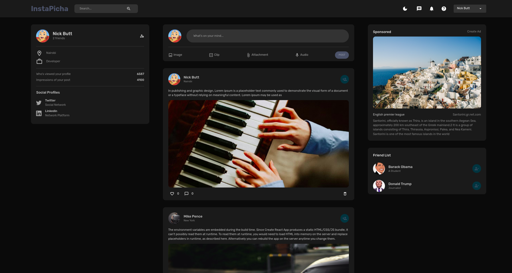
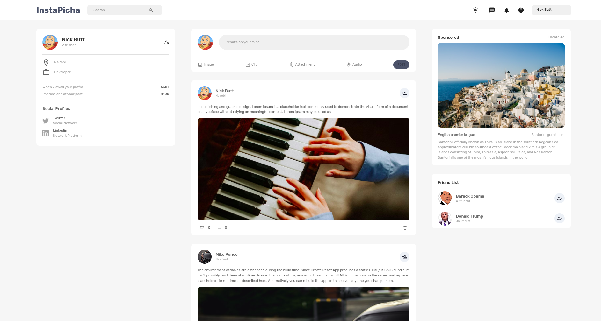

# Social Platform using MongoDB ExpressJs Redux and Node

## Overview
This is a brief introduction to an application that utilizes MongoDB, Express.js, Redux, and Node.js. The application is designed to provide a robust and efficient solution for data management, server-side logic, and state management.

## Technologies Used
The application is built using the following technologies:

- **MongoDB:** A powerful NoSQL database that offers flexibility and scalability for storing and managing data.
- **Express.js:** A fast and minimalist web application framework for Node.js, used to handle server-side logic and routing.
- **Redux:** A predictable state container for JavaScript applications, used for managing the application's state.
- **Node.js:** A JavaScript runtime environment that allows the application to be built and run on the server-side.

# How to use

## Start the backend node backend server

1. Install Mongo DB or use mongo atlas (mongodb.com)
2. Install NodeJs
3. Navigate to /server folder 
4. Run npm install
5. Run nodemon index.js

## start the front end client
1. cd to frontend folder
2. Run npm install
3. Run npm start

